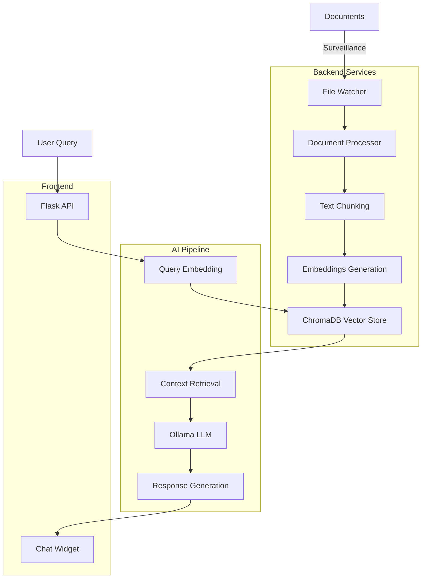

# ALEX Assistant IA - Chatbot avec RAG

Un assistant IA intelligent utilisant l'architecture RAG (Retrieval-Augmented Generation) avec Ollama et ChromaDB pour des réponses contextuelles basées sur vos documents.

## 🚀 Fonctionnalités

- **Interface web Flask** : Interface utilisateur simple et intuitive
- **RAG (Retrieval-Augmented Generation)** : Réponses basées sur vos documents indexés
- **Ollama Integration** : Utilise les modèles Granite et Nomic-Embed
- **ChromaDB** : Base de données vectorielle pour la recherche sémantique
- **Monitoring en temps réel** : Surveillance automatique des nouveaux documents
- **Optimisations de performance** : Cache, parallélisation, session pooling

## 🛠️ Architecture

```
┌─────────────────┐    ┌──────────────┐    ┌─────────────┐
│   Interface     │    │    ALEX      │    │   Ollama    │
│   Web Flask     │◄──►│   Backend    │◄──►│   Models    │
└─────────────────┘    └──────────────┘    └─────────────┘
                              │
                              ▼
                       ┌──────────────┐
                       │   ChromaDB   │
                       │  Vector DB   │
                       └──────────────┘
```

## 📋 Table des Matières

- [🎯 Vue d'ensemble](#-vue-densemble)
- [✨ Fonctionnalités](#-fonctionnalités)
- [🏗️ Architecture](#️-architecture)
- [🚀 Installation](#-installation)
- [⚙️ Configuration](#️-configuration)
- [💻 Utilisation](#-utilisation)
- [📁 Structure du Projet](#-structure-du-projet)
- [🔧 API et Endpoints](#-api-et-endpoints)
- [🎨 Interface Utilisateur](#-interface-utilisateur)
- [🚀 Déploiement](#-déploiement)
- [🔧 Troubleshooting](#-troubleshooting)
- [🤝 Contribution](#-contribution)
- [📄 Licence](#-licence)

## 🎯 Vue d'ensemble

**ALEX** (Assistant Learning and eXpert) est un chatbot intelligent développé par **Accel Tech** qui combine la puissance des modèles de langage (LLM) avec la recherche augmentée par récupération (RAG). Il transforme vos documents en une base de connaissances conversationnelle, permettant aux utilisateurs d'interagir naturellement avec le contenu de leurs documents.

### 🌟 Pourquoi ALEX ?

- **🔍 Recherche Intelligente** : Trouvez des informations dans vos documents par simple conversation
- **🤖 IA Contextuelle** : Réponses basées uniquement sur vos documents indexés
- **⚡ Temps Réel** : Surveillance automatique et indexation des nouveaux fichiers
- **🎨 Interface Moderne** : Widget de chat élégant à la manière des sites professionnels
- **🔒 Sécurisé** : Traitement local des données, aucune fuite d'information

## ✨ Fonctionnalités

### 🔄 Traitement Automatique de Documents
- **Surveillance en temps réel** du dossier de documents
- **Indexation automatique** des nouveaux fichiers
- **Support multi-formats** : PDF, DOCX, TXT, ODT
- **Chunking intelligent** pour optimiser la recherche
- **Détection des modifications** et re-indexation

### 🧠 Intelligence Artificielle
- **Modèle Mistral 7B** via Ollama pour la génération de réponses
- **Embeddings Nomic** pour la vectorisation des documents
- **Base vectorielle ChromaDB** pour la recherche sémantique
- **RAG optimisé** pour des réponses précises et contextuelles

### 🎨 Interface Utilisateur Moderne
- **Widget de chat flottant** comme sur les sites professionnels
- **Design Accel Tech** avec couleurs et branding authentiques
- **Responsive design** pour desktop, tablette et mobile
- **Animations fluides** et expérience utilisateur soignée
- **Mode plein écran** sur mobile pour une meilleure utilisation

### ⚡ Performance et Optimisation
- **Traitement parallèle** des documents
- **Cache intelligent** pour éviter la re-indexation
- **Surveillance automatique** en arrière-plan
- **API REST** pour intégration externe

## 🏗️ Architecture



### 🔧 Composants Techniques

- **Flask** : Serveur web et API REST
- **Watchdog** : Surveillance automatique des fichiers
- **ChromaDB** : Base de données vectorielle
- **Ollama** : Runtime pour modèles LLM
- **Threading** : Traitement asynchrone en arrière-plan

## 🌐 Architecture Web Complète

ALEX est une **application web full-stack** moderne combinant HTML, CSS, JavaScript et Flask :

### 🎨 **Frontend - Interface Utilisateur (HTML/CSS/JavaScript)**

```html
<!-- Structure HTML5 moderne avec widget de chat -->
<div class="chat-widget">
  <div class="chat-header">
    <h1>ALEX by Accel Tech</h1>
    <p>Modernize. Innovate.</p>
  </div>
  <div class="chat-container"><!-- Messages en temps réel --></div>
  <div class="chat-input-section"><!-- Interface de saisie --></div>
</div>
```

```css
/* Design CSS3 responsive avec animations professionnelles */
.chat-widget {
    position: fixed;
    bottom: 150px;
    right: 20px;
    width: 380px;
    height: 600px;
    background: white;
    border-radius: 20px;
    box-shadow: 0 20px 40px rgba(0, 0, 0, 0.15);
    animation: slideIn 0.4s cubic-bezier(0.4, 0, 0.2, 1);
}
```

```javascript
// JavaScript moderne pour interactions en temps réel
async function sendMessage() {
    const response = await fetch('/chat', {
        method: 'POST',
        headers: {'Content-Type': 'application/json'},
        body: JSON.stringify({message: userMessage})
    });
    const data = await response.json();
    displayResponse(data.response);
}
```

### ⚙️ **Backend - Serveur Flask (Python)**

```python
# Application Flask avec API REST complète
from flask import Flask, render_template_string, request, jsonify

app = Flask(__name__)

# Routes principales
@app.route('/')                           # Interface HTML/CSS/JS
@app.route('/chat', methods=['POST'])     # API Conversation IA
@app.route('/status')                     # API Statut indexation
@app.route('/force_check_new')            # API Vérification manuelle
@app.route('/reindex', methods=['POST'])  # API Réindexation

# Logique métier intégrée
class ALEXProClient:
    def chat(self, message):              # Intelligence conversationnelle
    def search_context(self, query):      # Recherche vectorielle
    def index_file(self, file_path):      # Indexation documents
```

### 📊 **Structure du Projet Web**

```
alex/
├── taipy-version/
│   └── app_taipy.py              # 🚀 APPLICATION WEB COMPLÈTE
│       ├── HTML_TEMPLATE         # 🎨 Interface utilisateur complète
│       │   ├── HTML5 structure
│       │   ├── CSS3 responsive design
│       │   └── JavaScript interactions
│       ├── Flask Routes          # ⚙️ API Backend
│       │   ├── @app.route('/')
│       │   ├── @app.route('/chat')
│       │   └── @app.route('/status')
│       ├── ALEXProClient        # 🧠 Intelligence IA/RAG
│       │   ├── Mistral 7B integration
│       │   ├── ChromaDB management
│       │   └── Document processing
│       └── File Monitoring       # 📁 Surveillance automatique
├── chroma_db/                    # 💾 Base vectorielle
├── documents/                    # 📄 Documents à analyser
└── .env                          # ⚙️ Configuration
```

### 🔄 **Communication Full-Stack**

```mermaid
graph LR
    A[🎨 Frontend<br/>HTML/CSS/JS] <-->|AJAX/Fetch| B[⚙️ Flask API<br/>Python Backend]
    B <-->|Queries| C[🧠 Mistral LLM<br/>via Ollama]
    B <-->|Vectors| D[💾 ChromaDB<br/>Vector Database]
    B <-->|Files| E[📁 File System<br/>Document Watch]
```



### 🌟 **Caractéristiques Techniques**

| **Couche** | **Technologies** | **Fonctionnalités** |
|------------|------------------|---------------------|
| **Frontend** | HTML5, CSS3, JS | Widget chat moderne, animations, responsive |
| **Backend** | Flask, Python | API REST, logique IA, gestion sessions |
| **IA Engine** | Mistral 7B, Ollama | Génération réponses, RAG, embeddings |
| **Data Layer** | ChromaDB, Vector DB | Recherche sémantique, indexation |
| **File System** | Watchdog, Threading | Surveillance automatique, traitement async |

### 🚀 **Avantages Architecture Web**

- ✅ **Application autonome** : Tout-en-un (frontend + backend + IA)
- ✅ **Interface moderne** : Widget professionnel comme les sites web actuels  
- ✅ **API REST complète** : Intégrable dans d'autres applications
- ✅ **Responsive design** : Compatible mobile et desktop
- ✅ **Déploiement simple** : Un seul fichier Python à lancer

## 🚀 Installation

### 📋 Prérequis

- **Python 3.10+**
- **Ollama** installé et configuré
- **Git** pour cloner le repository
- **Minimum 8GB RAM** recommandé pour les modèles LLM

### 🔽 Installation Rapide

```bash
# 1. Cloner le repository
git clone https://github.com/accel-tech/alex.git
cd alex

# 2. Créer l'environnement virtuel
python -m venv .venv

# 3. Activer l'environnement (Windows)
.venv\Scripts\activate

# 3. Activer l'environnement (Linux/Mac)
source .venv/bin/activate

# 4. Installer les dépendances
pip install -r taipy-version/requirements.txt

# 5. Configurer l'environnement
cp .env.example .env
# Éditer le fichier .env avec vos paramètres
```

### 🐳 Installation avec Docker

```dockerfile
# Dockerfile
FROM python:3.11-slim

WORKDIR /app
COPY . .

RUN pip install -r taipy-version/requirements.txt

EXPOSE 8504
CMD ["python", "taipy-version/app_taipy.py"]
```

```bash
# Construire et lancer
docker build -t alex-assistant .
docker run -p 8504:8504 alex-assistant
```

### 🤖 Configuration Ollama

```bash
# Installer Ollama
curl -fsSL https://ollama.ai/install.sh | sh

# Télécharger les modèles requis
ollama pull mistral:7b
ollama pull nomic-embed-text

# Vérifier l'installation
ollama list
```

## ⚙️ Configuration

### 📄 Fichier .env

```bash
# Configuration Ollama
OLLAMA_BASE_URL=http://localhost:11434  # URL de votre instance Ollama
OLLAMA_CHAT_MODEL=mistral:7b            # Modèle pour la génération
OLLAMA_EMBEDDING_MODEL=nomic-embed-text  # Modèle pour les embeddings

# Configuration ChromaDB
CHROMA_PERSIST_DIRECTORY=./chroma_db    # Dossier de stockage

# Configuration Application
APP_TITLE=ALEX - Assistant IA Accel Tech
APP_DESCRIPTION=Assistant intelligent avec RAG
MAX_FILE_SIZE_MB=10                     # Taille max des fichiers
CHUNK_SIZE=1500                         # Taille des chunks de texte
CHUNK_OVERLAP=100                       # Chevauchement des chunks

# Configuration Surveillance
WATCH_DIRECTORY=./DETECTION_FRAUDE      # Dossier à surveiller
AUTO_INDEXING=true                      # Indexation automatique
```

### 📂 Dossiers de Documents

Créez le dossier de surveillance des documents :

```bash
# Créer le dossier de surveillance
mkdir "C:\Users\USERNAME\Desktop\Projets et realisations\DETECTION FRAUDE"

# Y placer vos documents PDF, DOCX, TXT, ODT
```

## 💻 Utilisation

### 🚀 Lancement Rapide

```bash
# Naviguer vers le dossier du projet
cd taipy-version

# Lancer ALEX
python app_taipy.py
```

Le serveur démarre sur `http://127.0.0.1:8504`

### 🎯 Interface Web

1. **Ouvrir** `http://127.0.0.1:8504` dans votre navigateur
2. **Cliquer** sur le bouton flottant 💬 en bas à droite
3. **Commencer** à poser des questions sur vos documents
4. **Fermer** le chat en cliquant sur ✕

### 💡 Exemples d'Utilisation

#### 🤝 Salutations et Aide
```
🧑 Utilisateur: "Salut"

🤖 ALEX: 👋 Salut ! Je suis ALEX, votre assistant IA d'Accel Tech !

        🤖 Je suis là pour vous aider à explorer et analyser vos documents 
        de façon conversationnelle.

        💡 Comment m'utiliser :
        • Posez-moi des questions sur le contenu de vos documents
        • Je peux analyser, résumer et extraire des informations
        • J'ai accès aux documents dans votre dossier surveillé
```

#### 📚 Recherche dans Documents
```
🧑 Utilisateur: "Quelles sont les principales mesures de détection de fraude ?"

🤖 ALEX: Selon les documents indexés, les principales mesures de détection 
        de fraude incluent :
        
        1. **Surveillance en temps réel** des transactions
        2. **Analyse comportementale** des utilisateurs
        3. **Détection d'anomalies** par machine learning
        4. **Contrôles de cohérence** des données...
        
        [Source: directive_01_2009_CM_UEMOA-1.pdf, page 15]
```

### 🔧 API REST

```bash
# Envoyer un message
curl -X POST http://127.0.0.1:8504/chat \
  -H "Content-Type: application/json" \
  -d '{"message": "Votre question ici"}'

# Vérifier le statut
curl http://127.0.0.1:8504/status

# Forcer la réindexation
curl -X POST http://127.0.0.1:8504/reindex
```

## 📁 Structure du Projet

```
ALEX/
│
├── 📄 README.md                 # Cette documentation
├── 📄 .env                      # Configuration environnement
├── 📄 requirements.txt          # Dépendances Python
│
├── 📁 .venv/                    # Environnement virtuel Python
├── 📁 chroma_db/                # Base de données vectorielle
│
└── 📁 taipy-version/            # Version principale
    │
    ├── 🐍 app_taipy.py          # Application principale Flask
    ├── 📄 .env                  # Configuration locale
    ├── 📄 requirements.txt      # Dépendances spécifiques
    │
    ├── 📁 src/                  # Code source modulaire
    │   ├── 🐍 document_processor.py
    │   ├── 🐍 vector_store.py
    │   └── 🐍 chat_engine.py
    │
    ├── 📁 documents/            # Documents de test
    ├── 📁 chroma_db/            # Base vectorielle locale
    └── 📁 backup/               # Sauvegardes automatiques
```

### 📋 Description des Fichiers Clés

| Fichier | Description | Rôle |
|---------|-------------|------|
| `app_taipy.py` | 🚀 Application principale | Serveur Flask, API, Interface |
| `.env` | ⚙️ Configuration | Variables d'environnement |
| `requirements.txt` | 📦 Dépendances | Packages Python requis |
| `chroma_db/` | 🗄️ Base vectorielle | Stockage des embeddings |
| `documents/` | 📚 Documents test | Exemples pour développement |

## 🔧 API et Endpoints

### 🌐 Endpoints Principaux

| Méthode | Endpoint | Description | Paramètres |
|---------|----------|-------------|------------|
| `GET` | `/` | Interface principale | - |
| `POST` | `/chat` | Envoi de message | `{"message": "text"}` |
| `GET` | `/status` | État du système | - |
| `POST` | `/reindex` | Réindexation rapide | - |
| `POST` | `/force_full_reindex` | Réindexation complète | - |
| `GET` | `/diagnostic` | Diagnostic fichiers | - |

### 📊 Réponses API

#### Chat Response
```json
{
  "response": "Réponse générée par ALEX",
  "sources": ["document1.pdf", "document2.docx"],
  "processing_time": 1.23,
  "context_used": true
}
```

#### Status Response
```json
{
  "indexed_files_count": 15,
  "watch_directory": "C:/path/to/documents",
  "supported_extensions": [".pdf", ".docx", ".txt", ".odt"],
  "surveillance_status": "✅ Actif - Surveillance automatique",
  "auto_indexing": true,
  "indexed_files": ["file1.pdf", "file2.docx"]
}
```

## 🎨 Interface Utilisateur

### 🎯 Design Principles

- **🎨 Branding Accel Tech** : Couleurs authentiques (#1e3a8a, #2563eb, #1e40af)
- **📱 Mobile First** : Interface responsive pour tous les appareils
- **⚡ Performance** : Animations fluides 60fps, chargement optimisé
- **♿ Accessibilité** : Contraste élevé, navigation clavier, ARIA labels

### 🖼️ Composants Interface

#### 💬 Widget de Chat
- **Position** : Flottant en bas à droite
- **Taille** : 380px × 600px (desktop)
- **Responsive** : Plein écran sur mobile
- **Animation** : Slide-in avec cubic-bezier

#### 🎛️ Contrôles
- **Bouton d'ouverture** : 💬 avec effets hover
- **Bouton de fermeture** : ✕ avec rotation 90°
- **Input message** : Focus automatique, placeholder dynamique
- **Bouton envoi** : Gradient Accel Tech, effet hover

#### 📱 Responsive Breakpoints
```css
/* Desktop */
@media (min-width: 1024px) { ... }

/* Tablet */
@media (max-width: 768px) { ... }

/* Mobile */
@media (max-width: 480px) { ... }
```

## � Intégration dans d'autres Sites Web

ALEX peut être facilement intégré dans des sites web existants grâce à son architecture web complète :

### 📋 **Option 1: Intégration par iframe (Recommandée)**

```jsx
// Composant React pour intégrer ALEX
import React, { useState } from 'react';

const AlexWidget = () => {
  const [isOpen, setIsOpen] = useState(false);

  return (
    <>
      {/* Bouton flottant */}
      <button 
        onClick={() => setIsOpen(!isOpen)}
        style={{
          position: 'fixed',
          bottom: '20px',
          right: '20px',
          width: '60px',
          height: '60px',
          borderRadius: '50%',
          background: 'linear-gradient(135deg, #1e3a8a, #2563eb)',
          border: 'none',
          color: 'white',
          fontSize: '24px',
          cursor: 'pointer',
          zIndex: 1000
        }}
      >
        {isOpen ? '✕' : '💬'}
      </button>

      {/* Widget ALEX complet */}
      {isOpen && (
        <iframe
          src="http://127.0.0.1:8504"
          style={{
            position: 'fixed',
            bottom: '90px',
            right: '20px',
            width: '380px',
            height: '600px',
            border: 'none',
            borderRadius: '20px',
            boxShadow: '0 20px 40px rgba(0, 0, 0, 0.15)',
            zIndex: 999
          }}
        />
      )}
    </>
  );
};
```

### 🌐 **Option 2: Intégration API native**

```javascript
// Utilisation directe de l'API ALEX
async function chatWithAlex(message) {
    const response = await fetch('http://127.0.0.1:8504/chat', {
        method: 'POST',
        headers: {'Content-Type': 'application/json'},
        body: JSON.stringify({message: message})
    });
    
    const data = await response.json();
    return data.response;
}

// Exemple d'utilisation
const response = await chatWithAlex("Comment déployer un modèle sur OpenShift AI ?");
console.log(response);
```

### ⚙️ **Configuration CORS automatique**

ALEX inclut la configuration CORS pour permettre l'intégration cross-origin :

```python
# Configuration automatique dans app_taipy.py
@app.after_request
def after_request(response):
    response.headers.add('Access-Control-Allow-Origin', '*')
    response.headers.add('Access-Control-Allow-Headers', 'Content-Type,Authorization')
    response.headers.add('Access-Control-Allow-Methods', 'GET,PUT,POST,DELETE,OPTIONS')
    return response
```

### 📱 **Avantages de l'intégration**

- ✅ **Plug & Play** : Intégration en 5 minutes
- ✅ **Design conservé** : Toutes les fonctionnalités et animations
- ✅ **Multi-framework** : Compatible React, Vue, Angular, HTML simple
- ✅ **Responsive** : S'adapte automatiquement aux écrans
- ✅ **Maintenance simple** : Aucun code à dupliquer

### 🚀 **Étapes d'intégration**

1. **Démarrez ALEX** : `python app_taipy.py`
2. **Copiez le composant** dans votre projet
3. **Importez et utilisez** : `<AlexWidget />`
4. **Testez** : Le widget apparaît en bas à droite

## �🚀 Déploiement

### 🐳 Docker Production

```dockerfile
FROM python:3.11-slim

# Configuration production
ENV FLASK_ENV=production
ENV PYTHONUNBUFFERED=1

WORKDIR /app
COPY . .

RUN pip install --no-cache-dir -r taipy-version/requirements.txt

# Utilisateur non-root
RUN useradd -m alex
USER alex

EXPOSE 8504
CMD ["gunicorn", "--bind", "0.0.0.0:8504", "--workers", "2", "app_taipy:app"]
```

### ☁️ Cloud Deployment

#### Azure Container Apps
```bash
# Construire l'image
az acr build --registry myregistry --image alex:latest .

# Déployer
az containerapp create \
  --name alex-assistant \
  --resource-group mygroup \
  --image myregistry.azurecr.io/alex:latest \
  --target-port 8504 \
  --ingress external
```

#### OpenShift
```bash
# Construire l'image
podman build -t registry/alex:latest .

# Pousser vers le registry
podman push registry/alex:latest

# Déployer sur OpenShift
oc apply -f openshift-deployment.yaml
```

### 🔧 Configuration Production

```bash
# Variables d'environnement production
FLASK_ENV=production
OLLAMA_BASE_URL=https://your-ollama-endpoint.com
CHROMA_PERSIST_DIRECTORY=/data/chroma_db
MAX_WORKERS=4
RATE_LIMIT=100  # requêtes/minute
```

## 🔧 Troubleshooting

### ❌ Problèmes Courants

#### 1. Ollama non accessible
```bash
# Vérifier Ollama
curl http://localhost:11434/api/tags

# Redémarrer Ollama
systemctl restart ollama  # Linux
# ou relancer manuellement sur Windows
```

#### 2. Documents non indexés
```bash
# Vérifier les permissions du dossier
chmod 755 /path/to/documents

# Vérifier les logs
tail -f logs/alex.log

# Forcer la réindexation
curl -X POST http://127.0.0.1:8504/force_full_reindex
```

#### 3. Erreurs de mémoire
```bash
# Réduire la taille des chunks
CHUNK_SIZE=1000  # au lieu de 1500

# Augmenter la mémoire Python
export PYTHONHASHSEED=0
ulimit -v 8388608  # 8GB
```

### 📋 Checklist de Débogage

- [ ] ✅ Ollama est démarré et accessible
- [ ] ✅ Modèles Mistral et Nomic téléchargés
- [ ] ✅ Dossier de documents existe et est accessible
- [ ] ✅ Port 8504 n'est pas utilisé par une autre application
- [ ] ✅ Variables d'environnement correctement configurées
- [ ] ✅ Dépendances Python installées dans le bon environnement

## 🤝 Contribution

### 🎯 Comment Contribuer

1. **Fork** le repository
2. **Créer** une branche feature (`git checkout -b feature/AmazingFeature`)
3. **Commit** vos changements (`git commit -m 'Add: Amazing Feature'`)
4. **Push** sur la branche (`git push origin feature/AmazingFeature`)
5. **Ouvrir** une Pull Request

### 📋 Guidelines de Développement

- **Code Style** : PEP 8 pour Python, Prettier pour JavaScript
- **Tests** : Ajouter des tests pour les nouvelles fonctionnalités
- **Documentation** : Mettre à jour ce README si nécessaire
- **Commits** : Messages descriptifs en français ou anglais

### 🐛 Signalement de Bugs

Utilisez les [GitHub Issues](https://github.com/accel-tech/alex/issues) avec :
- Description claire du problème
- Étapes pour reproduire
- Environnement (OS, Python version, etc.)
- Logs d'erreur si disponibles

## 🏢 À propos d'Accel Tech

**Accel Tech** est une entreprise innovante spécialisée dans la transformation digitale et l'intelligence artificielle. Nous aidons les organisations à moderniser leurs processus et à adopter les technologies de pointe.

### 🎯 Notre Mission
> **Modernize. Innovate.** - Accélérer la transformation digitale de l'Afrique par l'innovation technologique.

### 🌐 Contact
- **Website** : [www.accel-tech.net](https://www.accel-tech.net)
- **Email** : contact@accel-tech.net
- **LinkedIn** : [Accel Tech](https://linkedin.com/company/accel-tech)

## � Licence

Ce projet est sous licence **MIT License**.

```
MIT License

Copyright (c) 2025 Accel Tech

Permission is hereby granted, free of charge, to any person obtaining a copy
of this software and associated documentation files (the "Software"), to deal
in the Software without restriction, including without limitation the rights
to use, copy, modify, merge, publish, distribute, sublicense, and/or sell
copies of the Software, and to permit persons to whom the Software is
furnished to do so, subject to the following conditions:

The above copyright notice and this permission notice shall be included in all
copies or substantial portions of the Software.

THE SOFTWARE IS PROVIDED "AS IS", WITHOUT WARRANTY OF ANY KIND, EXPRESS OR
IMPLIED, INCLUDING BUT NOT LIMITED TO THE WARRANTIES OF MERCHANTABILITY,
FITNESS FOR A PARTICULAR PURPOSE AND NONINFRINGEMENT. IN NO EVENT SHALL THE
AUTHORS OR COPYRIGHT HOLDERS BE LIABLE FOR ANY CLAIM, DAMAGES OR OTHER
LIABILITY, WHETHER IN AN ACTION OF CONTRACT, TORT OR OTHERWISE, ARISING FROM,
OUT OF OR IN CONNECTION WITH THE SOFTWARE OR THE USE OR OTHER DEALINGS IN THE
SOFTWARE.
```

---

<div align="center">

**Fait avec ❤️ par [Accel Tech](https://www.accel-tech.net)**

*Modernize. Innovate. - Transformez votre façon de travailler avec l'IA*


</div>